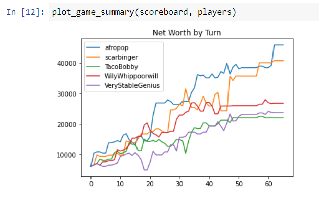

## pga
*Post-game analysis for Acquire board game*

[](https://mybinder.org/v2/gh/dpebert7/pga/master?filepath=main.ipynb)

### Example
```python
from pga import pga
sLog = """
  Lobby  Options  Global Chat  Game Chat
Player	L	T	A	F	W	C	I	Cash	Net
scarbinger		2	7				6	15300	29600
TacoBobby		6	1	11			9	14400	39100
VeryStableGenius		10					9	4500	25100
...
...
...
scarbinger purchased nothing.
scarbinger ended the game.
Game over.
"""
result = pga(sLog.splitlines())
log = result['log']
players = result['players']
scoreboard = result['scoreboard']
```




